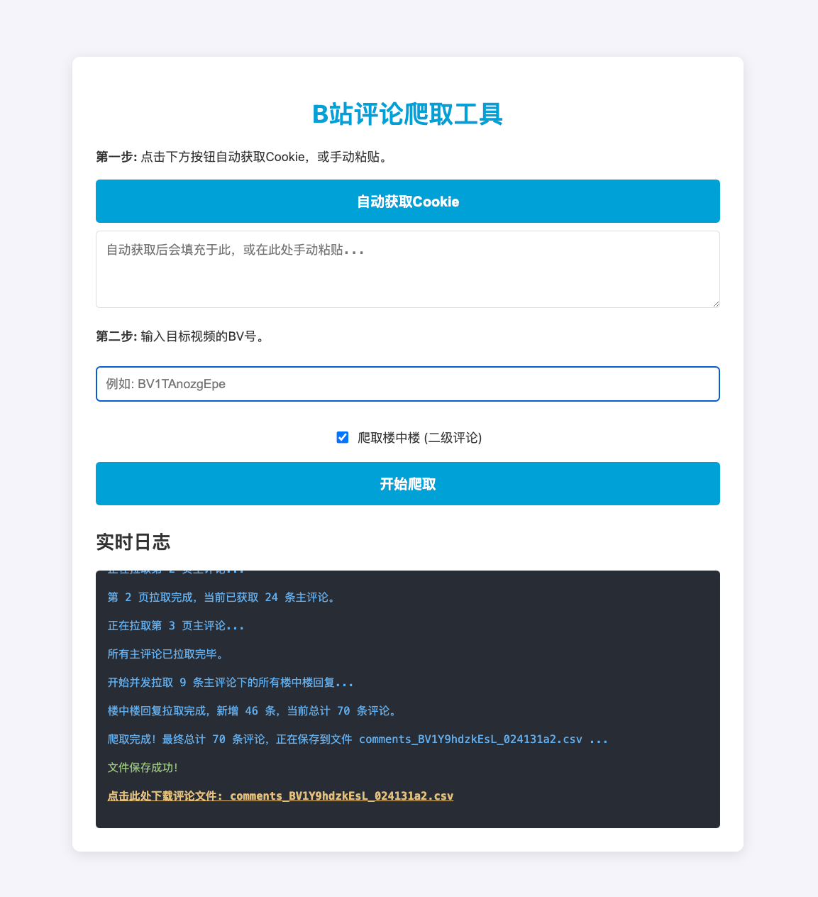

# Bilibili 评论爬取工具

这是一个基于 FastAPI 和 Playwright 的 Web 可视化B站评论抓取应用。用户可以通过简单的网页操作，实现自动登录获取Cookie、指定视频BV号、实时查看爬取日志，并最终下载包含所有评论（可选含楼中楼）的CSV文件。



## ✨ 功能特性

- **Web 可视化界面**: 无需编写任何代码，在浏览器中即可完成所有操作。
- **一键自动获取Cookie**: 利用 Playwright 自动打开浏览器，用户只需扫码登录B站，程序即可自动捕获必要的Cookie，极大降低了使用门槛。
- **指定BV号爬取**: 支持输入任意B站视频的BV号作为爬取目标。
- **支持爬取楼中楼**: 可自由选择是否需要深入爬取每条主评论下的二级评论（楼中楼回复）。
- **实时日志反馈**: 采用 Server-Sent Events (SSE) 技术，在网页上实时显示爬取过程中的每一步状态、进度和可能出现的错误。
- **CSV文件导出**: 爬取完成后，自动生成CSV格式的评论数据文件，并提供直接下载链接。
- **异步非阻塞**: 后端采用 FastAPI 和 asyncio，保证了高并发和流畅的用户体验。

## 🛠️ 技术栈

- **后端**:
    - **框架**: FastAPI
    - **Web服务器**: Uvicorn
    - **B站API库**: [bilibili-api](https://github.com/Nemo2011/bilibili-api)
    - **浏览器自动化**: Playwright
- **前端**:
    - **模板**: Jinja2
    - **样式与脚本**: 原生 HTML, CSS, JavaScript
- **实时通信**:
    - **Cookie获取**: WebSocket
    - **日志推送**: Server-Sent Events (SSE)

## 🚀 安装与运行

为了确保环境纯净且与项目兼容，**强烈建议使用 Conda 来管理 Python 环境**。

### 步骤 1: 环境准备

1.  **克隆项目**
    ```bash
    git clone https://github.com/ManiaAmaeOvo/bilibili_comment_scraper_webui
    cd bilibili_comment_scraper_webui
    ```

2.  **创建并激活 Conda 环境** (推荐使用 Python 3.11)
    ```bash
    # 创建一个名为 biliscraper 的新环境，并指定 python 版本为 3.11
    conda create -n biliscraper python=3.11 -y

    # 激活该环境
    conda activate biliscraper
    ```

### 步骤 2: 安装依赖

1.  **安装 Python 库**
    项目的所有 Python 依赖都记录在 `requirements.txt` 文件中。
    ```bash
    pip install -r requirements.txt
    ```

2.  **安装 Playwright 浏览器驱动 (非常重要！)**
    Playwright 需要一个真实的浏览器内核来执行自动化操作。`pip` 只安装了 Python 的库，我们还需要下载浏览器驱动。
    ```bash
    # 此命令会自动下载并安装 Chromium, Firefox, WebKit 等浏览器的驱动文件
    playwright install
    ```
    *如果网络不佳或只想安装 Chrome 驱动，可以使用 `playwright install chrome`。*

### 步骤 3: 启动项目

所有依赖安装完成后，在项目根目录下运行 `run.py`。
```bash
python run.py
```
启动成功后，您会看到类似以下的输出：
```
INFO:     Started server process [xxxxx]
INFO:     Waiting for application startup.
INFO:     Application startup complete.
INFO:     Uvicorn running on [http://127.0.0.1:8000](http://127.0.0.1:8000) (Press CTRL+C to quit)
```

## 📝 使用指南

1.  **访问应用**: 打开您的浏览器 (推荐使用 Chrome)，访问 [http://127.0.0.1:8000](http://127.0.0.1:8000)。

2.  **自动获取Cookie**:
    - 点击 **“自动获取Cookie”** 按钮。
    - 程序会自动打开一个新的浏览器窗口并导航到B站登录页。
    - 在网页的实时日志区域，您会看到提示。请按照提示，在**新弹出的浏览器窗口**中使用B站手机App扫描二维码完成登录。
    - 登录成功后，程序会自动跳转页面并捕获Cookie，然后将其填充到文本框中。此过程完成后，浏览器窗口会自动关闭。

3.  **输入视频BV号**: 在 "第二步" 的输入框中，填入您想要爬取评论的视频BV号（例如：`BV1TAnozgEpe`）。

4.  **选择是否爬取楼中楼**: 根据您的需求，勾选或取消勾选 **“爬取楼中楼 (二级评论)”** 复选框。

5.  **开始爬取**: 点击 **“开始爬取”** 按钮。下方的实时日志区会开始滚动显示爬取进度。

6.  **下载文件**: 当日志显示 "文件保存成功！" 时，下方会出现一个可点击的下载链接。点击该链接即可下载包含所有评论数据的 `.csv` 文件。

## 📁 项目结构

```
.
├── app                  # 主应用目录
│   ├── main.py          # FastAPI 核心逻辑：路由、WebSocket、SSE等
│   ├── scraper.py       # 爬虫核心模块，调用 bilibili-api
│   ├── static           # 静态文件
│   │   ├── css/style.css
│   │   └── js/main.js
│   └── templates        # Jinja2 前端模板
│       └── index.html
├── requirements.txt     # Python 依赖列表
└── run.py               # 项目启动文件
```

## 🙏 致谢

-   本项目的核心爬取功能依赖于强大的 **[bilibili-api](https://github.com/Nemo2011/bilibili-api)** 库，它极大地简化了与B站API的交互。感谢其作者的无私奉献。官方文档：[https://nemo2011.github.io/bilibili-api/](https://nemo2011.github.io/bilibili-api/)
-   感谢 **Google Gemini** 在代码编写、逻辑优化和文档撰写过程中提供的巨大帮助。